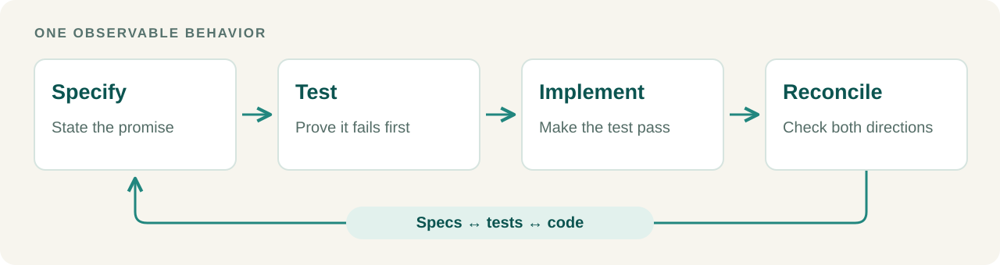

<p align="center">
  
</p>

<h1 align="center">SDD and TDD</h1>

<div align="center">

[](https://github.com/game-dev-rta-club/sdd-and-tdd/actions/workflows/ci.yml)
[](https://github.com/game-dev-rta-club/sdd-and-tdd/releases/latest)
[](LICENSE)

</div>

**Make specs, tests and code tell the same story.**

A portable agent skill that combines **specification-driven development (SDD)** and **test-driven development (TDD)**. Useful for new features, bug fixes and refactors.

## One behavior. One complete loop.

The specification states the promise. A failing test makes it concrete. The implementation fulfills it. Before the next change, check that all three still agree.



- **Small, reviewable changes.** Finish one behavior before starting another.
- **Tests with independent expectations.** Check the promise, not a copy of the code's calculation.
- **Specs that match shipped behavior.** Catch missing conditions as well as broken promises.

## Lightweight by design

Use your project's existing spec and test conventions. An unchanged promise needs no rewritten spec; a small change needs focused checks, not a ritual full-suite run.

One instruction skill. No runner, server or required companion skill. Works with Codex, Claude Code and other [Agent Skills](https://agentskills.io) hosts.

## Install and use

From your project:

```sh
npx skills@latest add game-dev-rta-club/sdd-and-tdd \
  --skill sdd-and-tdd \
  --agent codex claude-code \
  --yes
```

Keep the agents you use in `--agent`.

```text
Use the sdd-and-tdd skill to add password reset.
Expired links must be rejected. Keep the spec, tests and code aligned.
```

**Requires:** An Agent Skills-compatible coding agent and your project's normal tools. Node.js, npm and Git are needed for installation, not for running the skill. Read the [complete skill](skills/sdd-and-tdd/SKILL.md).

## Update

Rerun the install command to update explicitly. See the [release notes](CHANGELOG.md).

<details>
<summary>Install a specific release</summary>

```sh
npx skills@latest add https://github.com/game-dev-rta-club/sdd-and-tdd/tree/v0.1.0/skills/sdd-and-tdd \
  --agent codex claude-code --yes
```

</details>

For short, discoverable specifications, optionally pair with [Atomic Documentation](https://github.com/game-dev-rta-club/atomic-documantation).

## Project

[Game Dev RTA Club](https://github.com/game-dev-rta-club) · [MIT](LICENSE) · [Contributing](CONTRIBUTING.md) · [Code of Conduct](CODE_OF_CONDUCT.md) · [Security](SECURITY.md)
